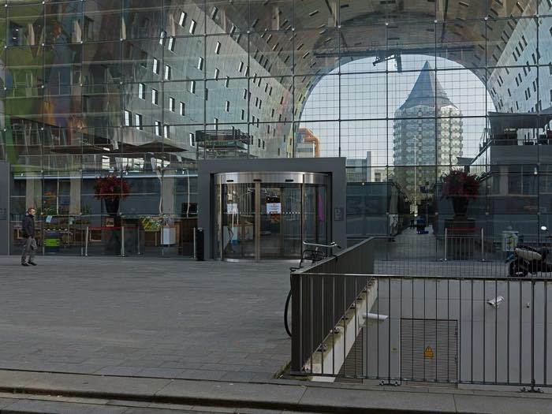

# Shane's Photograph Mapper

A photoshoot location scout. Capture or upload a photo, it reads the GPS location,
analyzes the image's colour balance and use-case, and drops it on a map so you can
find the right setting for a shoot and plan a route past several spots in one day.



## Features

- **Map of locations** with category-coloured pins (editorial, streetwear, luxury,
  golden hour, moody neon, nature, beach, portrait, architecture, industrial).
- **Balance read per spot**: colour palette, brightness, contrast, warmth, plus a
  composition breakdown (rule of thirds, symmetry, negative space, leading lines,
  depth), best time of day / season, and practical lighting and access notes.
- **Search a setting** ("neon", "golden hour", "bridal") and filter by category,
  warmth and minimum brightness.
- **Route planner**: tick several spots and it orders them by proximity, draws the
  path and gives distance plus a walk/drive estimate.
- **Capture flow**: take a photo with the camera or upload one. GPS is read straight
  from the photo's EXIF (falls back to device location or a map click), and the
  colour palette / brightness / contrast / warmth are measured from the pixels.
- Seeded with 30 real locations across 16 cities.

## View it on localhost

Pure Python standard library, no dependencies, nothing to install.

1. Clone the repo and enter it:
   ```bash
   git clone https://github.com/IsaacBraamGit/Shanes-Photograph-Mapper.git
   cd Shanes-Photograph-Mapper
   ```
2. Start the server:
   ```bash
   python3 -S server.py
   ```
   You should see `Photoshoot Scout running at http://localhost:8055`.
3. Open **http://localhost:8055** in your browser.

The 30 demo locations and their photos ship with the repo, so it looks the same for
everyone on first run. To stop the server press `Ctrl+C`. If port 8055 is taken,
change `PORT` at the top of `server.py`.

## How the analysis works

The image analysis is done client-side in `static/app.js`:

- `exifGps()` parses GPS coordinates out of the JPEG EXIF (no library).
- `analyzeImage()` draws the photo to a small canvas and computes the palette,
  brightness, contrast and warmth from the pixels.

The **category** is currently chosen by the user. Swapping in a vision model
(e.g. Gemini) to return category + mood + composition from the image is a drop-in
replacement for that one step.

## Data

- `data/locations.json` holds the locations. The server appends to it via
  `POST /api/locations` and removes via `DELETE /api/locations/<id>`.
- `fetch_images.py` regenerates the location photos from Wikimedia Commons.

## Credits

Location photographs are sourced from [Wikimedia Commons](https://commons.wikimedia.org)
and remain under their respective licences. Map tiles © OpenStreetMap contributors.
